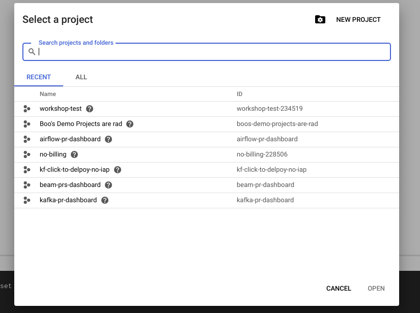
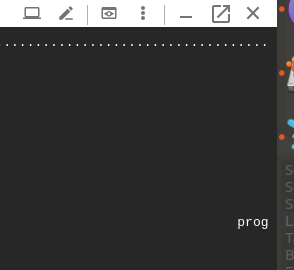
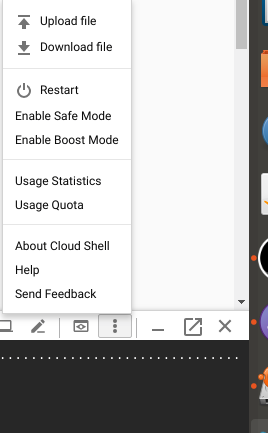
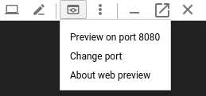

# Cross-cloud model training and serving with Kubeflow

This tutorial is designed to get you off-to-the races with cross-cloud Kubeflow.
If you don't already have a username and password for Google Cloud & Azure from the instructor go head and get one.

**Note:** If you're looking at this and the images are broken [click here](https://github.com/intro-to-ml-with-kubeflow/intro-to-ml-with-kubeflow-examples/blob/master/multi-cloud/README.md)


**Note:** If you find bugs, or have suggestions please consider e-mailing us, or submitting a PR if you know how to fix or improve it. There is also a shared [note's document](https://docs.google.com/document/d/1V6Q8z-BiaFCvdBaLg1n3BDTZpXsNroN24YFHXH7Ri68/edit?usp=sharing) that you are more than welcome to contribute to (and we can get you some coffee or SWAG as thanks)

**Note:** There is no need to make a GKE cluster manually before starting this tutorial, we will configure one as we go along.

## Motivation

We've picked a relatively un-complicated machine learning example, the data is already prepared, so that you can focus on exploring Kubeflow and how to deploy Kubeflow on multiple clouds.


We also train a default model so you don't get hung up on that, but it isn't a very good model for the problem, so if you've got time and want to explore more you can jump in there.


## For when thing's go wrong

Hopefully it hasn't broken for you, but in case something goes wrong feel free to come up here and take a look.

#### Solution guide

If at any point you get lost, that's totally normal. Feel free to look at the fancy (we use bash!) [solution shell scripts https://github.com/intro-to-ml-with-kubeflow/intro-to-ml-with-kubeflow-examples/tree/master/multi-cloud](https://github.com/intro-to-ml-with-kubeflow/intro-to-ml-with-kubeflow-examples/tree/master/multi-cloud).

In addition to the solution guide there are two videos walking through [part 1 on GCP](https://www.youtube.com/watch?v=rY-by2MDqvs) and [part 2 on IBM](https://www.youtube.com/watch?v=rY-by2MDqvs).
The second one is a little rough, sorry.


#### Debugging

There are a few different tools for debugging what's going wrong.
The `kubectl` program gives you a way to get the description of a pod which can include useful error information.

```bash
kubectl describe pod -n kubeflow [podname]
```

The logs of the pod also often contain useful information:

```bash
kubectl logs -n kubeflow [podname]
```

You can `exec` into a pod:

```bash
kubectl exec -it [podname] -n kubeflow -- /bin/bash
```

In Kubeflow it's common for there to be multiple containers, so you may need to add `-c main` (or similar) to get the logs.

#### If you want to start over

**Note:*** If you get into a really bad state there is also a cleanup script you may find useful.
Manually deleting the Kubernetes cluster can leave you in a weird state, since the GCP deployment has a number of ancillary services deployed along side.
The [cleanup script is at https://github.com/intro-to-ml-with-kubeflow/intro-to-ml-with-kubeflow-examples/blob/master/multi-cloud/cleanup.sh](https://github.com/intro-to-ml-with-kubeflow/intro-to-ml-with-kubeflow-examples/blob/master/multi-cloud/cleanup.sh).

```bash
curl https://raw.githubusercontent.com/intro-to-ml-with-kubeflow/intro-to-ml-with-kubeflow-examples/master/multi-cloud/cleanup.sh -o cleanup.sh
chmod a+x cleanup.sh
./cleanup.sh
source ~/.bashrc
```

## Set up

Kubeflow can be installed and deployed on many environments.
For today's tutorial we will focus on using Google, IBM, & Azure.
The provided set up script is designed to be used within a Google Cloud Console instance, however you are free to modify it to run locally or do your own set-up.

### Logging in to cloud console

If you already have a gcloud account you may find it easier to use incognito mode. You can log in to the cloud console by going to https://console.cloud.google.com.
Once you're in the default project should already be selected, but if not you can select it by clicking on the project drop down in the top left


Then selecting the project. Everyone may have a different project name, don't worry about this.


### Connecting to your Google Cloud Shell

You can lunch Google Cloud Shell by clicking on the >_ icon in the top right if you have gcloud installed in your laptop (make sure to use the workshop account so you don't get billed).


Note: there is a gcloud alpha ssh command, but we'll be use the webpreview which doesn't work out of the box with this.


This will give you a cloud shell, but before you dive in please enable boost mode by click on the 3 dots and selecting enable boost mode.





#### Optional: Using screen

Since conference WiFi is unpredictable, you may wish to use [screen](https://www.rackaid.com/blog/linux-screen-tutorial-and-how-to/).
This will allow you to re-connect your terminal session in another connection

### Setting up your instance & clusters

While there are many ways to set up Kubeflow, in the interest of speed we will start with using a fast setup script in this directory (`fast_setup.sh`).

If you wish to skip building an Azure cluster you can set: `SKIP_AZURE=1` as an environmental variable to the below script.

```bash
curl https://raw.githubusercontent.com/intro-to-ml-with-kubeflow/intro-to-ml-with-kubeflow-examples/master/multi-cloud/fast-start.sh -o fast-start.sh
chmod a+x fast-start.sh
SKIP_AZURE=1 ./fast-start.sh 2>&1 | tee startup-logs
echo $?
source ~/.bashrc
```

`fast_setup.sh` will do the following for you:

* Download Kubeflow and it dependencies
* Download Google & Azure's command line tools (if needed)
* Enable various components in
* Set up a GKE and EKS cluster (named google-kf-test & azure-kf-test)
* Creates your first Kubeflow App on GKE with some special customizations to avoid waiting for certificate provissioning

At that point it's going to be on you to start your Kubeflow adventure!

**Note:** Look up to see how to cleanup, in case you run into problems. tl;dr The [cleanup script is at https://github.com/intro-to-ml-with-kubeflow/intro-to-ml-with-kubeflow-examples/blob/master/multi-cloud/cleanup.sh](https://github.com/intro-to-ml-with-kubeflow/intro-to-ml-with-kubeflow-examples/blob/master/multi-cloud/cleanup.sh).

#### Alternatives

There is also [Kubeflow's click to deploy interface](https://deploy.kubeflow.cloud/#/deploy) (which can set up or skip IAP as desired) -- but to make this more cloud agnostic we avoided that option.


In addition to generating K8s configurations, Kubeflow also has the tools (for some platforms) to generate all of the ancillary configuration (enabling services, creating a K8s cluster, etc.).


`fast-start.sh` takes advantage of  `kfctl.sh` GCP platform generation and manually disables IAP mode.
For now the Azure resources are created manually inside of fast-start, but Azure has been added as a supported platform to `kfctl` in the master branch of Kubeflow.

### Loading your Kubeflow application

To support disabling IAP mode we've generated your GCP Kubeflow app and made some non-standard configuration changes.
To hide all our dirty laundry, we've done this by starting a Kubeflow application for you and setting some hidden parameters (you can look inside of fast-start.sh if you're curious).
To load your application and apply Kubeflow's Kubernetes configuration you run:


```bash
pushd g-kf-app
source env.sh
```

Kubeflow's main entry point is `kfctl.sh`, this has been added to your path with the fast-start but otherwise you can find this in the `${KUBEFLOW_SRC}/scripts/kfctl.sh`.
Now that you have your application loaded and a kubernetes cluster created, it's time to apply Kubeflow's kubernetes configuration:

```bash
kfctl.sh apply k8s
```


*Note*: This will take awhile, however if you're stuck waiting for the ambassador to deploy, double check that your cloudshell is running in boost mode. If it's not you may want to restart in boost mode, although you'll need to delete the deployment in deployment manager and start over, but trust us this is the best time to start over rather than 2 hours later.

Now you can see what's running in your cluster with:

```bash
kubectl get all --all-namespaces
```

You should see a variety of things deployed including the ambassador in the Kubeflow namespace e.g.:

```
kubeflow             deployment.apps/ambassador                                 3         3         3            3           19h
```

### Connecting to your Kubeflow Ambassador

The Kubeflow Ambassador gives you a nice web UI with which you can access many of Kubeflow's components.
Normally on GCP you'd set up Kubeflow in IAP mode which would give you easy access to the ambassador.

Since we're in a hurry today though we'll use port forwarding and the cloudshell web preview which is also pretty cool.

```bash
kubectl port-forward svc/ambassador -n kubeflow 8080:80 &
```

The cloudshell web preview button looks like and should be at the top of your cloudshell web interface


The default port should be 8080 which is the correct one, but you change it if not:



Now you can launch web preview and you should get the Kubeflow Ambassador page which looks something like:


### Adding components to your Kubeflow application


We want to install a few additional packages because we're going to be using
additional services.
Currently Kubeflow manages packages with [ksonnet](https://ksonnet.io/), although [this is changing](https://groups.google.com/forum/#!searchin/kubeflow-discuss/ksonnet%7Csort:date/kubeflow-discuss/Zg14_Ok7XH4/iL7bHZo6CgAJ).
`kfctl.sh` creates a ksonnet application inside of your kubeflow application called `ks_app`.
Ksonnet Packages which are shipped with kubeflow can be installed by going into the `ks_app` directory with and running `ks pkg install kubeflow/[package_name]`.


Our example uses [seldon core](https://www.seldon.io/) for model serving, called `seldon` inside of Kubeflow.

**Note:** All `ks` commands must be done within the `ks_app` directory.

```bash
cd ks_app
```

Once inside the `ks_app` directory, you can install `seldon`:

```bash
ks pkg install kubeflow/seldon
```

You can make sure it's installed by running `ks pkg list` and looking for `*` next to seldon:

```
programmerboo@cloudshell:~/g-kf-app-4/ks_app (workshop-test-234519)$ ks pkg list
REGISTRY NAME                    INSTALLED
======== ====                    =========
kubeflow application             *
kubeflow argo                    *
kubeflow automation
kubeflow chainer-job
kubeflow common                  *
kubeflow examples                *
kubeflow gcp                     *
kubeflow jupyter                 *
kubeflow katib                   *
kubeflow kubebench
kubeflow metacontroller          *
kubeflow modeldb                 *
kubeflow mpi-job                 *
kubeflow mxnet-job
kubeflow new-package-stub
kubeflow nvidia-inference-server
kubeflow openmpi
kubeflow openvino                *
kubeflow pachyderm
kubeflow pipeline                *
kubeflow profiles                *
kubeflow pytorch-job             *
kubeflow seldon                  *
kubeflow tensorboard
kubeflow tf-batch-predict
kubeflow tf-serving              *
kubeflow tf-training             *
```

If it is not installed (although the default path should install it), go ahead and install it now.
You can also try installing the `pachyderm` package, which can be useful later.

If this doesn't work for you, remember we have the [solutions](https://github.com/intro-to-ml-with-kubeflow/intro-to-ml-with-kubeflow-examples/blob/master/multi-cloud/solution2.sh) in the [repo](https://github.com/intro-to-ml-with-kubeflow/intro-to-ml-with-kubeflow-examples/tree/master/multi-cloud).

Once you've installed your new component you have the opportunity to configure it with:

```bash
ks param set [component_name] [config_key] [value]
```

For now, we don't need to configure anything inside of seldon, so we can use the default configuration.


If you change the configuration of a component (or if it's the first time installing it), you need to regenerate the yaml files for that component. This is done `ks generate`. We'll do this using the seldon prototype and seldon component:

```bash
ks generate [prototype] [component]
```

You can verify the components with:

```bash
ks component list
```

You should see `seldon` in this list, if not double check that your generate succeeded.

```
COMPONENT
=========
ambassador
application
argo
centraldashboard
cert-manager
cloud-endpoints
iap-ingress
jupyter
katib
metacontroller
notebooks
openvino
pipeline
profiles
pytorch-operator
seldon
spartakus
tf-job-operator
```


Now you can apply the new component

```bash
ks apply default -c seldon
```

You can also apply all of the components:

```bash
ks apply default
```


Now you can see what's running in your cluster with:

```bash
kubectl get all --all-namespaces
```

And also check the custom resource definitions (Seldon should have added something here):

```bash
$ kubectl get crd
...
seldondeployments.machinelearning.seldon.io
...
```


#### Optional: Adding Helm/Tiller for Seldon monitoring

We don't require it for our example, but Seldon has some additional monitoring tools you can install using Helm/Tiller. You can launch the Seldon Analytics Dashboard [here](https://github.com/kubeflow/example-seldon#setup)

#### Optional: Adding vendor/external components to your Kubeflow application

If you want to add packages which aren't part of the Kubeflow core,
you can add additional registries with `ks registry add`.
For example adding the h2o registry could be done with:

```bash
ks registry add h2o-kubeflow https://github.com/h2oai/h2o-kubeflow/tree/master/h2o-kubeflow
```

Now that you've add a new registry you can list the components and install them in the same way as with first party components up above.

### Setting up the requirements to train a simple model

#### Installing Argo

Argo is a workflow management tool, and serves as the basis of Kubeflow pipelines.
Currently, Kubeflow pipelines depend on some GCP specific components, so we will instead use Argo directly (this should be fixed eventually).

To download `argo` run.
```
curl -sSL -o ~/argo https://github.com/argoproj/argo/releases/download/v2.2.1/argo-linux-amd64
chmod +x ~/argo
```

Then we want to give the Kubeflow default service account permission to run everything it needs in the workflow:

```bash
kubectl create clusterrolebinding sa-admin --clusterrole=cluster-admin --serviceaccount=kubeflow:default
```

#### A place for your model to call home.

A persistent volume claim provides a way to store data with a lifecycle independent of the pod. It is a resource in the cluster just like a node is a cluster resource.

We'll use the persistent volume as a place to store the model during training, and then read it back for serving in a different pod.

```
kubectl create -f https://raw.githubusercontent.com/intro-to-ml-with-kubeflow/intro-to-ml-with-kubeflow-examples/master/multi-cloud/config/pv-claim.yaml -n kubeflow
```

Check to make sure it worked with

```
kubectl get pvc -n kubeflow
```

OR

https://console.cloud.google.com/kubernetes/storage

should look like this:


### Train the Model


#### Clone Example Seldon

This entire example is based loosely on https://github.com/kubeflow/example-seldon
we'll want to clone this repository to get the code and config files it uses.

```
cd ~/
git clone https://github.com/kubeflow/example-seldon
```


#### Optional- Monkey with the existing model.

Some people just want to do the basics- but not you- you're  a hard charger- you
want to do all the stuff. In this little section we're going to edit the model.

The original model that is being trained is a `RandomForrestClassifier` which is
a pretty rudimentary way to categorize handwritten digits, albeit giving 95% accuracy.

Luckily `sklearn` has a nice consistent API, so we can swap out about any classifier in its place.

To do this, in the place where you cloned `example-seldon` let's go edit the training file.

Go to `example-seldon/models/sk_mnist/train`.  Check the file `create_model.py`.

The lines of interest are 39 through 42
```
classifier = RandomForestClassifier(n_estimators=30)

classifier.fit(data[:n_samples // 2], targets[:n_samples // 2])
```

Thanks to the magic of python- you don't even need to change the second line.

You'll need to import your new classifier (up towards the beginning), and here on line 39
declare classifier as what ever new and better one you want.

While you're in here, please take a look at various things like the rest of `create_model.py`, `Dockerfile`, and `build_and_push.sh`.

These are all interesting things, but going in to the finer details of creating a workflow is a bit out of scope, and we feel you can figure it out pretty easily on your own once this is done.


### Ok Now train it.


**IF** you didn't monkey with the model:
```bash
export EXAMPLE_SELDON=~/example-seldon
cd $EXAMPLE_SELDON/workflows
~/argo submit training-sk-mnist-workflow.yaml -n kubeflow
```

**ELSE IF** you monkeyed with the model, you'll need to build a new image, put it somewhere your Kubernetes cluster can access and configure the pipeline to use it.

Building a Docker image is fairly straight forward provided that you already have Docker installed.
The `Dockerfile` specifies what goes in a Docker image. To build this into an image you will go back to the `models/sk_mnist/train/`.


Looking at the `Makefile` we can see that the image is normally built with `docker build --force-rm=true -t seldonio/skmnistclassifier_trainer:0.2 .`


The `--force-rm` forces removal the intermediate containers during the build. When you build a docker container you can think of it as building something akin to a layer cake, where the different layers are stacked on top of each other to make something delicious (except instead it uses something called [union filesystem](https://medium.com/@paccattam/drooling-over-docker-2-understanding-union-file-systems-2e9bf204177c) by default).


**TODO**: Add a cat with a layer cake creative commons commercial used licensed image here. **Pull requests welcome**


The above explanation was just added so we can have a picture of a cat with some cake :) **Note** Three hours can be a long time! Remember to drink water/coffee/eat snacks as necessary. While your model trains can be a great time for a break.


The `t` "tags" (or names) the image, specifying a user, container, and version.
We're going to keep the same image name (`skmnistclassifier_trainer`), but for now we're not going to associate it with any particular user and we're going to increase the version number to 0.3 so we can tell the difference with our own version.


```bash
docker build --force-rm=true -t skmnistclassifier_trainer:0.3 .
```


Since we're deploying this on a cluster we'll need to put the image in something called a container registry.
To give your local Docker permission, the [Google container registry](https://cloud.google.com/container-registry/) is configured with:

```bash
gcloud auth configure-docker
```

Your Google container registry](https://cloud.google.com/container-registry/) is at `gcr.io/${GOOGLE_PROJECT}`, so we'll tag our image to this base and push it up:

```bash
docker tag skmnistclassifier_trainer:0.3 gcr.io/${GOOGLE_PROJECT}/skmnistclassifier_trainer:0.3
```

Once an image is tagged, you still need to explicitly push it to the container registry to make it available:

```bash
docker push gcr.io/${GOOGLE_PROJECT}/skmnistclassifier_trainer:0.3
```


Now that it's all set up and pushed, we can run the previous pipeline pointing to our custom image in the container registry.

```bash
export EXAMPLE_SELDON=~/example-seldon
cd $EXAMPLE_SELDON/workflows
~/argo submit training-sk-mnist-workflow.yaml -n kubeflow -p docker-user=gcr.io/${GOOGLE_PROJECT} -p version=0.3
```

**Note**: There is also an (optional) build push step in the workflow, however with GCR it's a bit easier to just build it by hand. If you want you can explore doing the build-push as part of the workflow as well (although it requires your code to be pushed to Github).

### Ok now let's monitor it.

The easiest way to monitor the model progress is using the following two shell commands:

```
kubectl get pods -n kubeflow -w | grep sk-train
## AND
watch ~/argo list -n kubeflow
```

These will hopefully show a successfully running set of pods / job.

You should follow along as the Pod goes from `Pending` --> `ContainerCreating` --> `Running` --> `Completed` using the get kubectl pods command.

In addition, you can use the `~/argo get [WORKFLOW_NAME] -n kubeflow`, `~/argo list [WORKFLOW_NAME] -n kubeflow`, `~/argo describe [WORKFLOW_NAME] -n kubeflow`, and `~/argo delete [WORKFLOW_NAME] -n kubeflow` to interact with workflows that you create.

### Serve the Model

Once training has finished, we can serve it with:

```
cd $EXAMPLE_SELDON/workflows
~/argo submit serving-sk-mnist-workflow.yaml -n kubeflow  -p deploy-model=true
```

We already have a port-forward of the ambassador service, which in addition to exposing the Web UIs also exposes the model serving.

If you want to access the ambassador from inside Kubeflow (e.g. Jupyter), just use the Ambassador hostname (e.g. "ambassador") which is essentially the same as `kubectl get svc/ambassador -n kubeflow -o json | jq -r .spec.clusterIP`.

The deployment name is based on your pipeline, ours is `mnist-classifier`.

You can query the Seldon deployments with the following:

```bash
kubectl get seldondeployment -n kubeflow
```

and since we trained the MNIST classifer, this results in:

```
mnist-classifier
```

### Query the Model

You can query the model by hitting the following REST endpoint with a CURL request:

```bash
# The version should be v0.1 to start
http://<ambassadorEndpoint>/seldon/<deploymentName>/api/<version>/predictions
```

**OR** you can do predictions on the model in an interactive way, via a Jupyter
notebook launched from the Ambassador. This can be done by clicking
Web Preview > Preview on port 8080 > Jupyter hub (as discussed above), and
launching a Python3 kernel.


In the Jupyter notebook, which has an [example](https://github.com/intro-to-ml-with-kubeflow/intro-to-ml-with-kubeflow-examples/blob/master/multi-cloud/query_seldon.ipynb) here, you will take an example
MNIST image and run an example prediction on it.

Firstly, you will need to install the necessary python modules:

```python
import requests
import numpy as np
from tensorflow.examples.tutorials.mnist import input_data
!pip3 install matplotlib
from matplotlib import pyplot as plt
```

and define functions that will download the MNIST Dataset and an image generator:

```python
def download_mnist():
    return input_data.read_data_sets("MNIST_data/", one_hot = True)
def gen_image(arr):
    two_d = (np.reshape(arr, (28, 28)) * 255).astype(np.uint8)
    plt.imshow(two_d,cmap=plt.cm.gray_r, interpolation='nearest')
    return plt
```

You would then retrieve a single batch which includes a tuple of `(feature, class)`,
and build a CURL request which contains the `feature`.

```python
mnist = download_mnist()
batch_xs, batch_ys = mnist.train.next_batch(1)
chosen=0
gen_image(batch_xs[chosen]).show()
data = batch_xs[chosen].reshape((1,784))
features = ["X"+str(i+1) for i in range (0,784)]
request = {"data":{"names":features,"ndarray":data.tolist()}}
```

Now we are ready to make a CURL request :)

```python
deploymentName = "mnist-classifier"
AMBASSADOR_API_IP="ambassador"
uri = "http://"+AMBASSADOR_API_IP+"/seldon/"+deploymentName+"/api/v0.1/predictions"
response = requests.post(
    uri,
    json=request)
```

and print the response:

```python
print(response.text)
```

You can now peak at the `data:ndarray` to see which class
(indexed respectively to `data:names`) scored the highest.

Check to see if that class is the same as `batch_ys` (the truth label)
or the image that is shown.

**CONGRATS** You have just deployed, served, and queried an end-to-end ML model.

#### Getting the model ready for serving on another cloud

This workflow saves the model results to a persistent-volume-claim, however we can't move this between clouds.
To support this we will configure using GCS or another [S3 compatable backend credintals as in the IBM guide](https://github.com/intro-to-ml-with-kubeflow/ibm-install-guide/blob/master/once-cluster-is-up.sh).


Tensorflow has the ability to write to object stores, and the [tfjob operator component has been improved to make this easier](https://github.com/kubeflow/examples/pull/499/files) (however it's not in the current release)
using secrets for managing the object store credentials.


Instead, for now, we'll use another pipeline step to upload the results from our training pipleine into an object store.
Since this depends on which object store you want to put this in we'll talk about this in the cloud specific guides linked to bellow.


**Note:** This is not great practice, longer term you'll want to use something like the update tfjob operator or otherwise store and fetch credentials rather than putting them in source.


#### Monitor the serving

If you set up the optional Seldon analytics, you should be able to monitor and analyze your models
via the Prediction analytics in the Seldon Core API Dashboard (available on Graphana)

### Optional: s/sklearn/tensorflow/

A non-zero percentage of you probably came here looking for Tensorflow on Kubernetes, and random forest isn't all that good for mnist anyways.

Now we train a Tensorflow model really quickly:

```bash
argo submit training-tf-mnist-workflow.yaml -n kubeflow
```

And party on*


## Starting a new Kubeflow project for Azure/IBM

Now that we've got everything working on GCP, it's time to take our model and serve it on another cloud provider.

For an Azure cluster

```bash
az aks get-credentials --name azure-kf-test --resource-group westus
```

Since Azure platform isn't supported in 0.4.1  we'll instead use it as a "raw" k8s cluster.
Kubeflow provides `kfctl.sh` is also used to bootstrap a new kubeflow project:


```bash
kfctl.sh init azure-app --platform none
cd azure-app
kfctl.sh generate k8s
kfctl.sh apply k8s
```

For an IBM cluster it's very similar and covered in both the [IBM serving guides](https://github.com/intro-to-ml-with-kubeflow/intro-to-ml-with-kubeflow-examples/tree/master/multi-cloud/ibm/serving) and [IBM training](https://github.com/intro-to-ml-with-kubeflow/intro-to-ml-with-kubeflow-examples/tree/master/multi-cloud/ibm/training).


You don't need to retrain your model on IBM just to serve it, if you follow the IBM serving guide, step 3 covers how to set this up.


For Azure, you are on your own. But it is largely the same idea (e.g. use something similar to boto to upload the result etc.)

## Next steps and other resources

We hope this has been useful to you and increased your interest in learning more about Kubeflow.
The Kubeflow project [has a collection of examples on GitHub](https://github.com/kubeflow/examples).
There is also a [discussion list](https://groups.google.com/forum/#!forum/kubeflow-discuss) and [the Kubeflow slack](http://kubeflow.slack.com) [and invite link](https://kubeflow.slack.com/join/shared_invite/enQtNDg5MTM4NTQyNjczLWUyZGI1ZmExZWExYWY4YzlkOWI4NjljNjJhZjhjMjEwNGFjNmVkNjg2NTg4M2I0ZTM5NDExZWI5YTIyMzVmNzM) for your questions.


Boris @ LightBend has written a series of blog posts on how to use [Kubeflow With OpenShift](https://www.lightbend.com/blog/how-to-deploy-kubeflow-on-lightbend-platform-openshift-kubeflow-tensorflow-jobs).


Some of us are also working on [a book about Kubeflow, and you can join the mailing list to find out more](http://www.introductiontomlwithkubeflow.com/).
